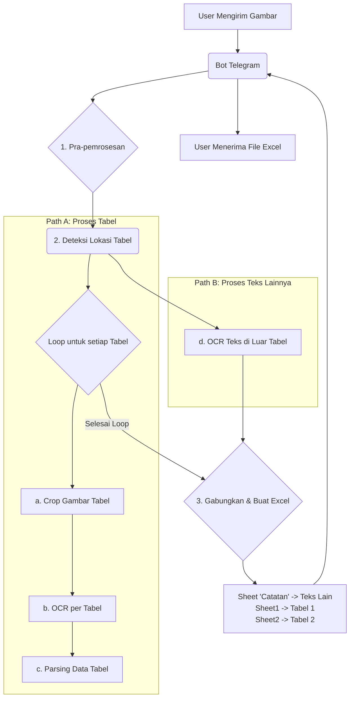

# Rencana Arsitektur: Bot Telegram Konversi Gambar ke Excel

Dokumen ini menguraikan arsitektur yang direncanakan untuk bot Telegram yang mampu mengonversi gambar berisi data tabular menjadi file Excel yang terstruktur dengan baik.

## Tujuan Utama

Membangun alur kerja yang tangguh untuk mengekstrak data dari gambar, memisahkannya menjadi data tabular dan non-tabular, dan menyajikannya dalam file Excel yang bersih, di mana setiap tabel berada di sheet terpisah dan teks lainnya ada di sheet ringkasan.

## Arsitektur & Alur Kerja

Berikut adalah diagram alur kerja yang disepakati:



### Detail Langkah-langkah

1.  **Pra-pemrosesan Gambar:** Membersihkan gambar input untuk memaksimalkan akurasi OCR.

    - **Teknologi:** `OpenCV`
    - **Tugas:** Grayscaling, Binarization (Thresholding), Deskewing, Noise Removal.

2.  **Deteksi & Isolasi Data:**

    - **Teknologi:** `OpenCV`
    - **Tugas:**
      - Mendeteksi koordinat (bounding box) dari semua tabel pada gambar.
      - Membuat "topeng" (mask) untuk memisahkan area tabel dari area non-tabel.

3.  **Ekstraksi Paralel:**

    - **Path A (Data Tabular):**
      - Untuk setiap tabel yang terdeteksi, lakukan crop pada gambar asli.
      - Jalankan OCR (`Pytesseract`) pada gambar hasil crop.
      - Parse output teks menjadi struktur data yang rapi (`Pandas DataFrame`).
    - **Path B (Data Non-Tabular):**
      - Jalankan OCR pada sisa gambar (di luar area tabel).

4.  **Generasi File Excel:**

    - **Teknologi:** `Pandas`
    - **Tugas:**
      - Buat sebuah file Excel baru.
      - Tulis hasil OCR non-tabular ke dalam sheet bernama `"Catatan"`.
      - Tulis setiap DataFrame tabel ke dalam sheet terpisah (`Tabel 1`, `Tabel 2`, dst.).

5.  **Pengiriman:** Bot mengirimkan file `.xlsx` yang telah digenerasi kepada pengguna.

## Struktur Proyek yang Direkomendasikan

```
/bot-telegram-image-to-excel
|-- bot.py                 # Logika utama bot Telegram
|-- image_processor.py     # Fungsi untuk pra-pemrosesan & deteksi tabel
|-- data_parser.py         # Fungsi untuk parsing output OCR (tabular & non-tabular)
|-- excel_generator.py     # Modul untuk membuat file Excel dari data terstruktur
|-- requirements.txt       # Daftar library yang dibutuhkan (python-telegram-bot, opencv-python, pytesseract, pandas, openpyxl)
|-- .env                   # Untuk menyimpan token bot
|-- /output/               # Direktori untuk menyimpan file Excel sementara
|-- PLAN.md                # Dokumen perencanaan ini
```
